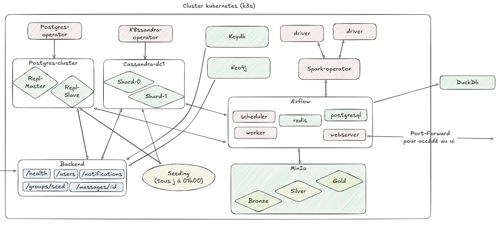
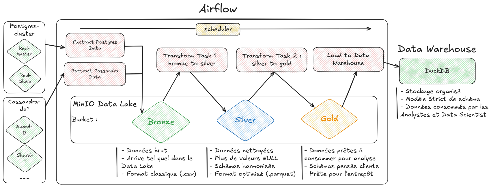
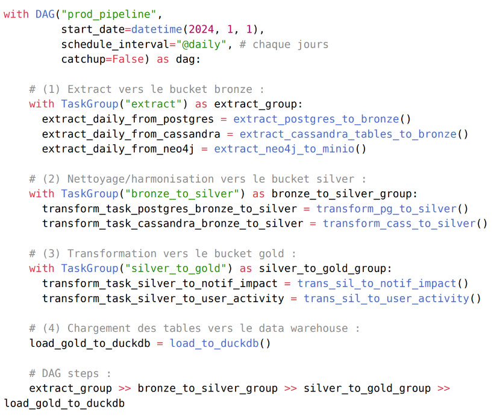

# Distributed Data Architecture - Engineering School Project

This repository contains the source code and configuration files for a distributed data management and processing architecture. It was developed as part of our fourth-year engineering studies at Junia ISEN, in the Big Data specialization.

## Table of Contents
1. [Project Overview](#project-overview)
2. [Architecture Summary](#architecture-summary)
3. [Data Pipeline (ELT)](#data-pipeline-elt)
4. [Backend System](#backend-system)
    - [API Endpoints Overview](#api-endpoints-overview)
        - [PostgreSQL](#postgresql-via-typeorm)
        - [Cassandra](#cassandra-via-cassandra-driver)
        - [MinIO](#minio-s3-compatible-storage)
5. [Folder Descriptions](#folder-descriptions)
6. [Summary Of The Technologies Used](#summary-of-the-technologies-used)
7. [Getting Started](#getting-started)
    - [Prerequisites](#prerequisites)
    - [Installation](#installation)
    - [Deployment](#deployment)
    - [Usage](#usage)
8. [Features](#features)
9. [Future Improvements](#future-improvements)
10. [Known Challenges](#known-challenges)
11. [Fully Described Documentation](#documentation)
12. [Authors](#authors)


## Project Overview

The goal of this project was to transform a simple web application's backend and storage system into a scalable, production-grade data architecture, capable of handling large-scale data ingestion, processing, and analytics.

We built a modern distributed system using industry-standard tools to:

- Ensure horizontal scalability and resilience
- Orchestrate multiple services in a containerized environment
- Process and transform large volumes of data
- Support analytical and decision-making use cases

## Architecture Summary



Our infrastructure includes:

- **Kubernetes (K3s)** for container orchestration
- **Helm** for declarative deployments
- **PostgreSQL** for structured relational data
- **Cassandra** for high-write NoSQL data
- **Neo4j** for graph-based relationships
- **KeyDB** for distributed caching
- **MinIO** as an S3-compatible data lake
- **Apache Spark** for distributed data processing
- **Apache Airflow** for pipeline orchestration
- **DuckDB** as an embedded data warehouse
- **NestJS** as the backend API (Node.js)

Each service is deployed in containers and managed via Helm charts within the Kubernetes cluster.

## Data Pipeline (ELT)



The data pipeline follows a **medallion architecture**:

1. **Bronze** – Raw data extracted daily from PostgreSQL and Cassandra
2. **Silver** – Cleaned and harmonized data stored in Parquet format
3. **Gold** – Aggregated and business-oriented data, loaded into DuckDB

The current main DAG of the project looks like this :


Orchestration is handled using Airflow DAGs running in Kubernetes, with tasks written in Python using Pandas and PySpark.

## Backend System

The backend focuses on the management and advanced testing of each storage system using automatically generated mock data, ensuring a comprehensive technical validation of the distributed architecture.

### API Endpoints Overview

#### PostgreSQL (via TypeORM)
- **GET** `http://localhost:3000/users` - Retrieve the list of users.
- **GET** `http://localhost:3000/users/:id` - Retrieve a user by ID.
- **POST** `http://localhost:3000/users` - Create a new user.
- **GET** `http://localhost:3000/groups` - Retrieve the list of groups.
- **GET** `http://localhost:3000/groups/:id` - Retrieve a group by ID.
- **POST** `http://localhost:3000/groups` - Create a new group.

#### Cassandra (via cassandra-driver)
- **GET** `http://localhost:3000/messages/:conversationId` - Retrieve messages from a conversation.
- **POST** `http://localhost:3000/messages` - Insert a new message.
- **GET** `http://localhost:3000/notifications/:userId` - Retrieve notifications for a user.
- **POST** `http://localhost:3000/notifications` - Insert a new notification.

#### MinIO (S3-Compatible Storage)

- **POST** `http://localhost:3000/storage/upload`  
    Upload a file using the `file` field in form-data.

- **GET** `http://localhost:3000/storage/download/:filename`  
    Download a file by specifying the filename in the URL.  
    Example: `http://localhost:3000/storage/download/test-image.png`

```
Projet-M1/ 
|   # backend part :
├── backend-distributed-api/
│   ├── dist/                        # Compiled files after build
│   ├── node_modules/                # Project dependencies
│   ├── notebooks/                   # API testing and performance analysis
│   │   ├── api_tests.ipynb          # Comprehensive database tests
│   │   └── data_analysis.ipynb      # Advanced analyses (later)
│   ├── src/
│   │   ├── config/                  # General & DB configurations
│   │   │   ├── config.module.ts
│   │   │   ├── postgres.config.ts
│   │   │   ├── redis.config.ts
│   │   │   ├── neo4j.config.ts
│   │   │   ├── cassandra.config.ts
│   │   │   └── storage.config.ts
│   │   ├── controllers/             # REST API controllers
│   │   │   ├── user.controller.ts
│   │   │   ├── message.controller.ts
│   │   │   ├── notification.controller.ts
│   │   │   ├── group.controller.ts
│   │   │   └── storage.controller.ts
│   │   ├── databases/               # Database-specific modules
│   │   │   ├── postgres/
│   │   │   │   ├── postgres.module.ts
│   │   │   │   └── postgres.provider.ts
│   │   │   ├── redis/
│   │   │   │   ├── redis.module.ts
│   │   │   │   └── redis.provider.ts
│   │   │   ├── neo4j/
│   │   │   │   ├── neo4j.module.ts
│   │   │   │   └── neo4j.provider.ts
│   │   │   ├── cassandra/
│   │   │   │   ├── cassandra.module.ts
│   │   │   │   └── cassandra.provider.ts
│   │   │   └── storage/
│   │   │       ├── storage.module.ts
│   │   │       └── storage.provider.ts
│   │   ├── models/                  # Database schemas
│   │   │   ├── postgres/
│   │   │   │   ├── user.entity.ts
│   │   │   │   └── group.entity.ts
│   │   │   ├── cassandra/
│   │   │   │   ├── message.model.ts
│   │   │   │   └── notification.model.ts
│   │   │   └── neo4j/
│   │   │       └── relationship.model.ts
│   │   ├── services/                # Business logic
│   │   │   ├── postgres/
│   │   │   │   ├── user.service.ts
│   │   │   │   └── group.service.ts
│   │   │   ├── cassandra/
│   │   │   │   ├── message.service.ts
│   │   │   │   └── notification.service.ts
│   │   │   ├── neo4j/
│   │   │   │   └── relationship.service.ts
│   │   │   ├── redis/
│   │   │   │   └── cache.service.ts
│   │   │   └── storage/
│   │   │       └── file-storage.service.ts
│   │   ├── scripts/                 # Advanced utility scripts
│   │   │   ├── postgres_fake_data.ts
│   │   │   ├── cassandra_fake_data.ts
│   │   │   ├── neo4j_fake_data.ts
│   │   │   └── storage_upload_test.ts
│   │   ├── shared/                  # Common interfaces and DTOs
│   │   │   ├── dto/
│   │   │   │   ├── user.dto.ts
│   │   │   │   ├── message.dto.ts
│   │   │   │   └── notification.dto.ts
│   │   │   └── interfaces/
│   │   │       └── generic.interface.ts
│   │   ├── app.module.ts            # Root NestJS module
│   │   └── main.ts                  # Application entry point
│   ├── uploads/                     # Temporary file storage before Bucket upload
│   ├── .dockerignore
│   ├── .env                         # Global environment variables
│   ├── .gitignore
│   ├── .prettierrc
│   ├── Dockerfile
│   ├── docker-compose.yml
│   ├── package.json
│   ├── tsconfig.json
│   └── README.md
```

### Folder Descriptions

- **config/**: Configuration modules for each database.
- **controllers/**: REST route management for each entity.
- **databases/**: Providers and modules specific to database connections.
- **models/**: Schemas and entities for each database.
- **services/**: Business logic for database interactions.
- **scripts/**: Mock data generation scripts for testing.
- **shared/**: Shared DTOs and interfaces between services.
- **uploads/**: Temporary file storage before Bucket upload.


## Summary Of The Technologies Used

- **Languages**: Python, TypeScript, SQL, Cypher
- **Frameworks**: NestJS, Apache Airflow, Apache Spark
- **Databases**: PostgreSQL, Cassandra, Neo4j, KeyDB, DuckDB
- **Orchestration**: Kubernetes, Helm
- **Storage**: MinIO (S3 buckets)
- **Data Processing**: Pandas, PySpark

## Getting Started

> ⚠️ Please complete the following setup sections based on your specific environment.

### Prerequisites

- Docker
- kubectl
- Helm
- k3s or any Kubernetes cluster
- Python 3.10+

### Installation

_TODO: Add instructions for cloning the repo, setting up the environment, and deploying the architecture._

### Deployment

_TODO: Include how to apply Helm charts, configure Kubernetes resources, and start services._

### Usage

_TODO: Describe how to interact with the backend, run Airflow pipelines, and access DuckDB analytics._


## Features

- Declarative, modular, entreprise-level infrastructure
- Fully containerized microservices architecture
- Horizontal scaling (via Kubernetes)
- Daily automated ELT pipeline
- Multi-modal storage: relational, NoSQL, graph, object
- Analytical-ready data warehouse with DuckDB

## Future Improvements

- Enable real-time ingestion (Kafka, CDC)
- Automated data quality tests
- More advanced Neo4j API integration
- Multi-datacenter Cassandra replication (currently support only single center)
- ML pipeline extensions (only analytics usage for now)

## Known Challenges

- Complex Kubernetes configurations
- Cassandra tuning for test environments
- Spark operator complexity

## Fully Described Documentation

Refer to the [Technical Report (French)](./pictures/fiche_technique_projet_m1.pdf) for a more detailed explanation of the system design, components and our motivations with this project.

## Authors

- Cyprien Kelma
- Nathan Eudeline  
- Nolan Cacheux
- Paul Pousset  
- Mamoun Kabbaj  

> © 2025 - Junia ISEN – Big Data Specialization  
> For educational and demonstration purposes only.