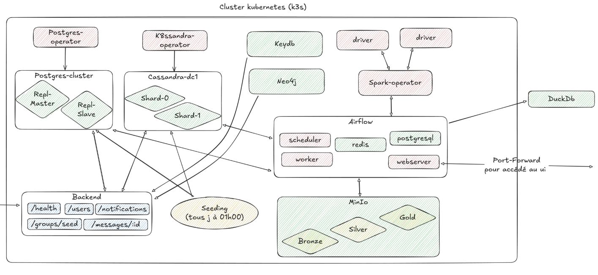
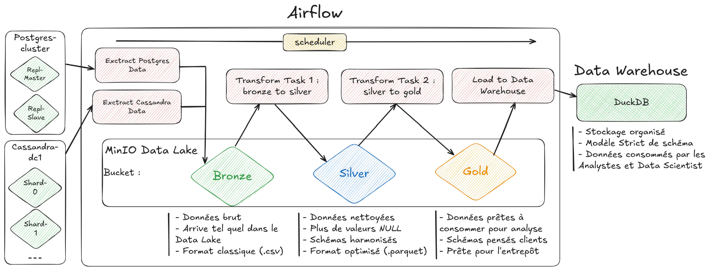
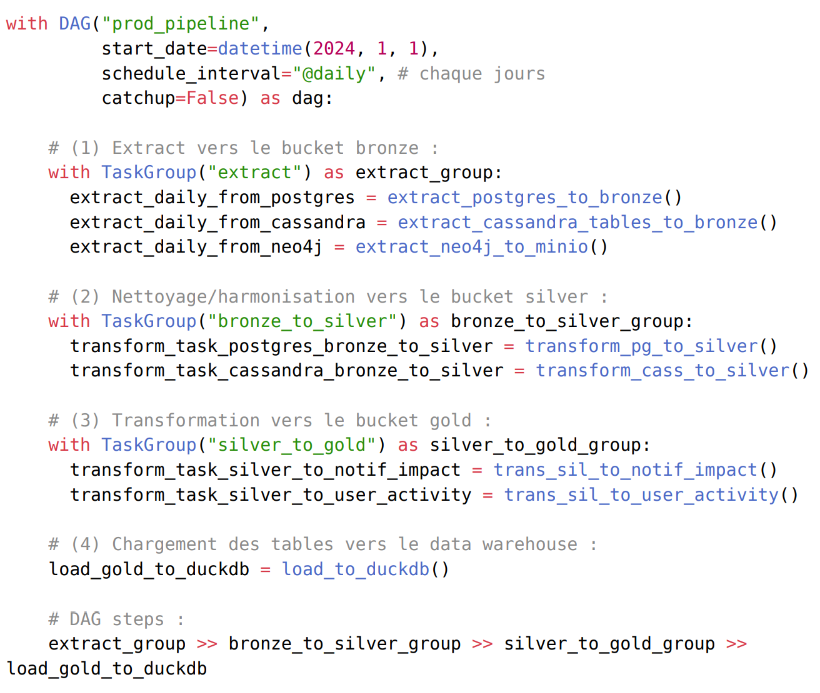

# Distributed Data Architecture - Engineering School Project

This repository contains the source code and configuration files for a distributed data management and processing architecture. It was developed as part of our fourth-year engineering studies at Junia ISEN, in the Big Data specialization.

## Table of Contents
1. [Project Overview](#project-overview)
2. [Architecture Summary](#architecture-summary)
3. [Data Pipeline (ELT)](#data-pipeline-elt)
4. [Features](#features)
5. [Backend System](#backend-system)
6. [Future Improvements](#future-improvements)
7. [Known Challenges](#known-challenges)
8. [Fully Described Documentation](#fully-described-documentation)
9. [Authors](#authors)

## Project Overview

The goal of this project was to transform a simple web application's backend and storage system into a scalable, production-grade data architecture, capable of handling large-scale data ingestion, processing, and analytics.

We built a modern distributed system using industry-standard tools to:

- Ensure horizontal scalability and resilience
- Orchestrate multiple services in a containerized environment
- Process and transform large volumes of data
- Support analytical and decision-making use cases

## Architecture Summary

Our infrastructure includes:

- **Kubernetes (K3s)** for container orchestration
- **Helm** for declarative deployments
- **PostgreSQL** for structured relational data
- **Cassandra** for high-write NoSQL data
- **Neo4j** for graph-based relationships
- **KeyDB** for distributed caching
- **MinIO** as an S3-compatible data lake
- **Apache Spark** for distributed data processing
- **Apache Airflow** for pipeline orchestration
- **DuckDB** as an embedded data warehouse
- **NestJS** as the backend API (Node.js)

Each service is deployed in containers and managed via Helm charts within the Kubernetes cluster.

## Data Pipeline (ELT)

The data pipeline follows a **medallion architecture**:

1. **Bronze** – Raw data extracted daily from PostgreSQL and Cassandra
2. **Silver** – Cleaned and harmonized data stored in Parquet format
3. **Gold** – Aggregated and business-oriented data, loaded into DuckDB

The current main DAG of the project looks like this :

Orchestration is handled using Airflow DAGs running in Kubernetes, with tasks written in Python using Pandas and PySpark.

## Backend System

The backend focuses on the management and advanced testing of each storage system using automatically generated mock data, ensuring a comprehensive technical validation of the distributed architecture.

### API Endpoints Overview

#### PostgreSQL (via TypeORM)
- **GET** `http://localhost:3000/users` - Retrieve the list of users.
- **GET** `http://localhost:3000/users/:id` - Retrieve a user by ID.
- **POST** `http://localhost:3000/users` - Create a new user.
- **GET** `http://localhost:3000/groups` - Retrieve the list of groups.
- **GET** `http://localhost:3000/groups/:id` - Retrieve a group by ID.
- **POST** `http://localhost:3000/groups` - Create a new group.

#### Cassandra (via cassandra-driver)
- **GET** `http://localhost:3000/messages/:conversationId` - Retrieve messages from a conversation.
- **POST** `http://localhost:3000/messages` - Insert a new message.
- **GET** `http://localhost:3000/notifications/:userId` - Retrieve notifications for a user.
- **POST** `http://localhost:3000/notifications` - Insert a new notification.

#### MinIO (S3-Compatible Storage)

- **POST** `http://localhost:3000/storage/upload`  
    Upload a file using the `file` field in form-data.

- **GET** `http://localhost:3000/storage/download/:filename`  
    Download a file by specifying the filename in the URL.  
    Example: `http://localhost:3000/storage/download/test-image.png`

## Features

- Declarative, modular, entreprise-level infrastructure
- Fully containerized microservices architecture
- Horizontal scaling (via Kubernetes)
- Daily automated ELT pipeline
- Multi-modal storage: relational, NoSQL, graph, object
- Analytical-ready data warehouse with DuckDB

## Future Improvements

- Enable real-time ingestion (Kafka, CDC)
- Automated data quality tests
- More advanced Neo4j API integration
- Multi-datacenter Cassandra replication (currently support only single center)
- ML pipeline extensions (only analytics usage for now)

## Known Challenges

- Complex Kubernetes configurations
- Cassandra tuning for test environments
- Spark operator complexity

## Fully Described Documentation

Refer to the [Technical Report (French)](https://drive.google.com/file/d/1x0aIjapqhaVRPJEvIRTzORIR9aschmZv) for a more detailed explanation of the system design, components and our motivations with this project.

## Authors

- Cyprien Kelma
- Nathan Eudeline  
- Nolan Cacheux
- Paul Pousset  
- Mamoun Kabbaj  

> © 2025 - Junia ISEN Engineering School – Big Data Specialization  
> For educational and demonstration purposes only.
