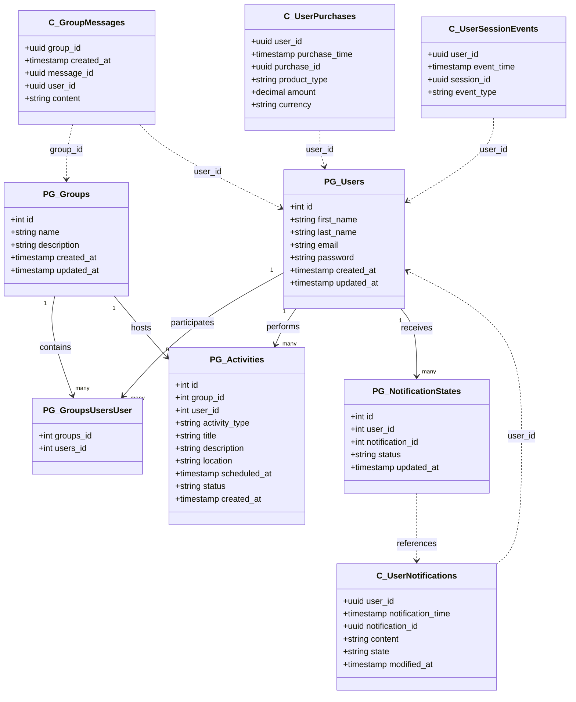

# Database Migrations Module

This module manages database schemas for both PostgreSQL and Cassandra databases using containerized migration tools and Helm charts for Kubernetes deployment.

## Overview

The migrations module provides an organized approach to:
- Define, version and apply database schema changes
- Deploy migrations as Kubernetes jobs
- Support both PostgreSQL and Cassandra databases
- Reset databases when needed during development

## Architecture

The system consists of:

- **PostgreSQL migrations**: Using [dbmate](https://github.com/amacneil/dbmate) for SQL migrations
- **Cassandra migrations**: Using custom CQL scripts with versioning
- **Helm chart**: For deploying as Kubernetes jobs
- **Docker images**: Containerized migration tools

## Database Schema



## Usage

### Prerequisites

- Docker installed and configured
- Access to a Kubernetes cluster
- `kubectl` configured to access your cluster
- `helm` installed

### Configuration

Edit the `helm/migrations/values.yaml` file to configure database connection details:

```yaml
postgresql:
  env:
    host: your-postgres-host
    username: your-username
    password: your-password
    database: your-database

cassandra:
  env:
    host: your-cassandra-host
    username: your-username
    password: your-password
    keyspace: your-keyspace
```

### Creating New Migrations

### PostgreSQL

1. Navigate to the `postgres` directory
2. Create a new migration using the dbmate script:
   ```bash
   ./dbmate.sh new your_migration_name
   ```
   This will create a new SQL file in `postgres/migrations/` with the naming convention `YYYYMMDDHHMMSS_your_migration_name.sql`

3. Edit the file and add your schema changes between the `-- migrate:up` and `-- migrate:down` markers:
   ```sql
   -- migrate:up
   CREATE TABLE your_table (
     id SERIAL PRIMARY KEY,
     name TEXT
   );

   -- migrate:down
   DROP TABLE IF EXISTS your_table;
   ```

#### Cassandra

1. Create a new CQL file in `cassandra/migrations/` with the naming convention `NNN_description.cql`
2. Add your CQL commands to create or modify tables

### Building and Deploying

Use the provided deploy script:

```bash
# Deploy migrations
./deploy.sh

# Deploy with database reset (caution: destroys data)
./deploy.sh --reset
```

## How It Works

1. Docker images are built for both PostgreSQL and Cassandra migrations
2. Helm deploys Kubernetes jobs that run these images
3. PostgreSQL migrations use dbmate to track and apply changes
4. Cassandra migrations use a custom script to track applied migrations in a table
5. Each migration runs only once

## Troubleshooting

- Check Kubernetes job logs: `kubectl logs job/migrations-postgres-migrations`
- Verify database connectivity from within cluster
- Use `--reset` flag to start fresh if migrations are in a failed state
