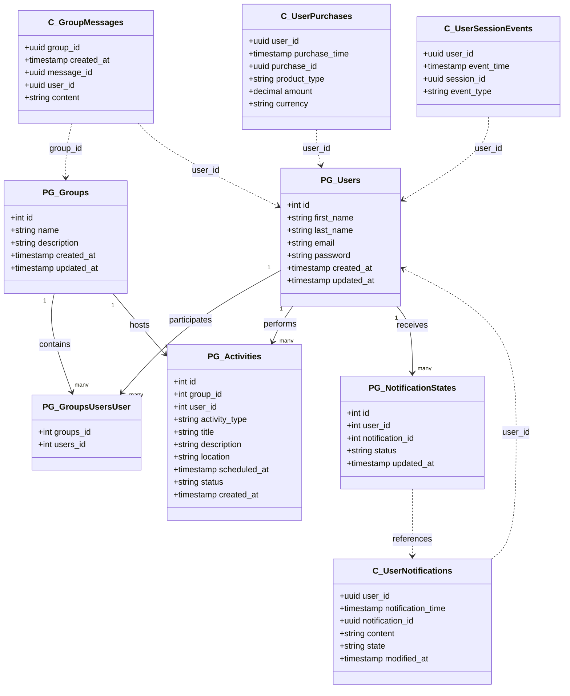

# Database Migrations & Seeding Module

This module manages schema migrations and initial data seeding for both PostgreSQL and Cassandra databases in Kubernetes environments.

## Purpose

- Define, version, and apply schema changes for PostgreSQL and Cassandra.
- Deploy migrations and seeding as Kubernetes jobs via Helm.
- Support database resets and flexible data volumes for development/testing.

## Technologies Used

- **PostgreSQL** & **Cassandra** (databases)
- **dbmate** (PostgreSQL migrations)
- **Custom CQL scripts** (Cassandra migrations)
- **Docker** (containerized migration/seeding tools)
- **Helm** (Kubernetes deployment)
- **Node.js** & **Deno** (data seeding scripts)
- **faker.js** (realistic test data generation)

## Structure

- `postgres/` – PostgreSQL migrations (dbmate, SQL files, Dockerfile)
- `cassandra/` – Cassandra migrations (CQL scripts, Dockerfile)
- `seeding/` – Deno-based seeding scripts (Postgres & Cassandra)
- `seeding-node/` – Node.js-based seeding scripts (alternative)
- `helm/` – Helm charts for deploying migrations and seeding as jobs
- `deploy.sh` – Orchestrates build and deployment

## Prerequisites

- Docker
- Kubernetes cluster & `kubectl`
- Helm 3

## Database Schema



## Usage

### 1. Configure Database Connections

Edit `helm/migrations/values.yaml` and `helm/seeding/values.yaml` to set database hosts, credentials, and keyspaces.

### 2. Build and Push Migration Images

```sh
cd migrations
./deploy.sh
```
This builds Docker images for migrations and deploys them as Kubernetes jobs.

- Use `./deploy.sh --reset` to drop and recreate schemas.
- Use `./deploy.sh --seed` to run data seeding after migrations.

### 3. Creating New Migrations

**PostgreSQL:**
```sh
cd postgres
./dbmate.sh new add_new_table
# Edit the generated SQL file in postgres/migrations/
```

**Cassandra:**
- Add a new `.cql` file in `cassandra/migrations/` (e.g., `005_add_table.cql`).

### 4. Seeding Data

- Seeding jobs run automatically if `--seed` is passed to `deploy.sh`.
- Data volume (small/medium/large) can be set in values or via `DATA_VOLUME` env var.

## Monitoring & Troubleshooting

- Check job status:
  `kubectl get jobs`
- View logs:
  `kubectl logs job/<job-name>`
- Reset databases if migrations fail:
  `./deploy.sh --reset`

## Customization

- Adjust data volume for seeding (`small`, `medium`, `large`, `prod`).
- Add/modify migration scripts as needed.
- Use either Deno or Node.js seeding scripts.

## License

See main project license.
